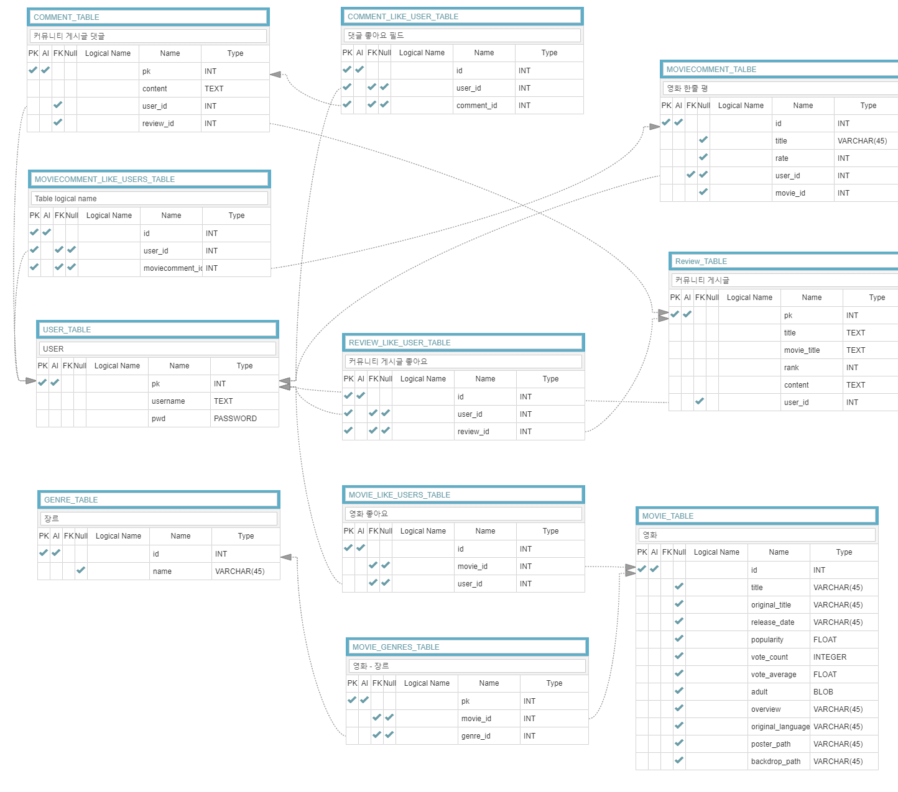

# 싸MDB Vue_movie

> 사용자 취향 기반 영화 추천 서비스 


### 팀명 : 서른즈음에  (*2020.06.11 ~* )

| 직책 | 이름        | 메인            | 서브            |
| ---- | ----------- | --------------- | --------------- |
| 팀장 | 박진수 (30) | FRONT ( VUE )   | BACK ( Django ) |
| 팀원 | 김재영 (30) | BACK ( Django ) | FRONT ( VUE )   |


### 구현기능

**유저**

- 회원가입/로그인/로그아웃 
- 유저 디테일 페이지 (좋아요한 영화와 장르 통계 조회가능)
- ADMIN 페이지 구현 (영화 DB 조작 가능)


**영화**

-  날짜별 BOXOFFICE 순위 (kobis)
-  한줄평 (평점) 등록/변경/삭제
-  영화 상세보기 및 좋아요 기능
- 영화 장르별 필터링 기능
- 영화 검색 기능
- 영화 페이지네이션
-  영화 추천 
  - 사용자 좋아요(장르), 평점 기반 추천 알고리즘
    - 사용자가 좋아요 눌렀던 영화 장르별 우선순위를 기반으로 영화 추천
    - 좋아요가 없을 경우 설정된 기본 알고리즘으로 영화 추천 (시간마다 달라짐)

**게시판**

- 공개 커뮤니티 
- 게시글 작성 및 댓글 작성/수정/삭제 기능


### ERD



### URLs

**MOVIE**

| Method | Request                                    |      |
| ------ | ------------------------------------------ | ---- |
| `POST` | `like/<int:movie_id>/`                     |      |
| `GET`  | `searchmovie/<str:movie_title>/`           |      |
| `GET`  | `searchmovies/genres/`                     |      |
| `GET`  | `detail/<int:movie_id>/`                   |      |
| `GET`  | `moviecomment/<int:movie_id>/`             |      |
| `POST` | `moviecomment/<int:movie_id>/create'`      |      |
| `POST` | `genre/`                                   |      |
| `GET`  | `getlikemovies/`                           |      |
| `POST` | `add_movie/<int:movie_id>/`                |      |
| `GET`  | `recommend/`                               |      |
| `POST` | `deletemoviecomment/<int:moviecomment_id>` |      |

**REVIEW**

| METHOD | REQUEST                            |      |
| ------ | ---------------------------------- | ---- |
| `GET`  | `detail/<int:review_id>/`          |      |
| `POST` | `create/`                          |      |
| `POST` | `update/<int:review_id>/`          |      |
| `POST` | `delete/<int:review_id>/`          |      |
| `POST` | `reviewlike/<int:review_id>/`      |      |
| `GET`  | `comment/<int:review_id>/`         |      |
| `GET`  | `comment/detail/<int:comment_id>/` |      |
| `POST` | `comment/create/<int:review_id>/`  |      |
| `POST` | `commentlike/<int:comment_id>/`    |      |


#### 요청 예시

**Request**

`GET /movies/`

**Params**

`pages` : 1 ~ 1112

**Response**

```
content-type = application/json
```


**Request**

`POST /reviews/create/`

**Headers**

`Authorization : Token {token}`

**Response**

```
content-type = application/json
```


### 프로젝트 구성 & 기술 스택

|           | 언어         | Framework        | DB                   | 기타                              | 개발환경  |
| --------- | ------------ | ---------------- | -------------------- | --------------------------------- | --------- |
| **FRONT** | `JavaScript` | `Vue CLi (vuex)` |                      | `Bootstrap`,`HTML5` `CSS3` `Ajax` | `node.js` |
| **BACK**  | `Python 3.7` | `Django 2.2.7`   | `sqlite3`,`Postgres` | `rest-framework`                  | `venv`    |


### 활용 API

1. TMDB (https://www.themoviedb.org/documentation/api)
2. 영화진흥위원회 오픈 API (https://www.kobis.or.kr/kobisopenapi/homepg/apiservice/searchServiceInfo.do)

### 사용 기술

axios, vue router, bootstrap

